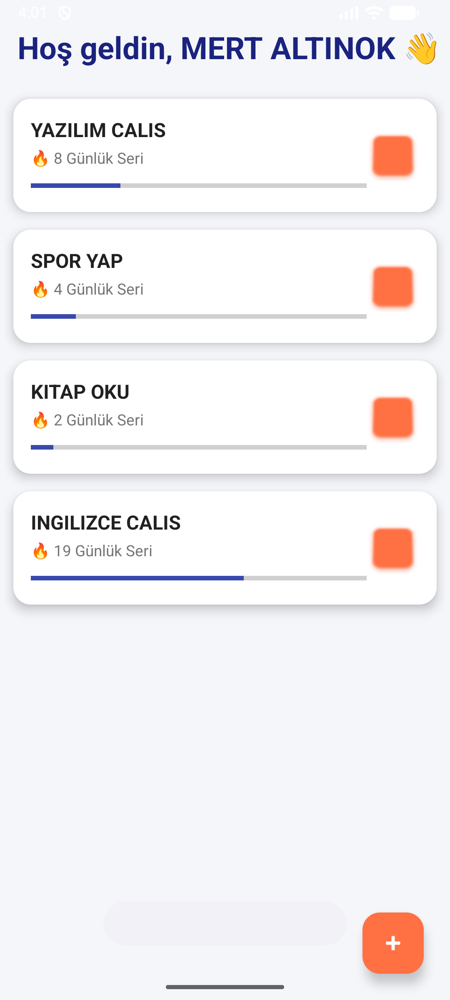

Zinciri Kırma (Habit Tracker)

Bu proje, **Yönetim Bilişim Sistemleri** bölümü **Mobil Programlama** dersi final ödevi kapsamında geliştirilmiştir. Kullanıcıların günlük alışkanlıklarını takip etmelerini ve "zinciri kırma" metodolojisi ile motivasyonlarını korumalarını amaçlayan bir Android uygulamasıdır.

## Proje Özellikleri
* **Alışkanlık Yönetimi (CRUD):** Yeni alışkanlık ekleme, listeleme, düzenleme ve silme.
* **İlerleme Takibi:** Her alışkanlık için günlük seri (streak) takibi ve görsel ilerleme çubuğu.
* **Veri Kalıcılığı:** SQLite veritabanı ile verilerin cihazda güvenli saklanması.
* **Kişiselleştirme:** `SharedPreferences` kullanılarak kullanıcı isminin hatırlanması ve özel karşılama mesajı.
* **Modern Arayüz:** Material Design bileşenleri, CardView ve özel renk paleti.

##  Kullanılan Teknolojiler
* **Dil:** Java
* **IDE:** Android Studio
* **Veritabanı:** SQLite (Yerel Veritabanı)
* **Arayüz:** XML (ConstraintLayout, RecyclerView)

##  Ekran Görüntüleri

  
  

---
**Geliştirici:** Mert Altınok
